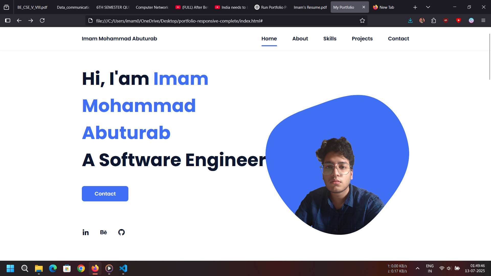

# 💼 Personal Portfolio Website

This is a responsive personal portfolio website built using **HTML**, **CSS**, and **JavaScript**. It showcases my projects, skills, contact information, and a little about me.

---

## 📌 Features

- Smooth scrolling navigation
- Responsive design (mobile-friendly)
- Project section with hover descriptions
- Animated skill bars
- Contact form (can be connected to email services)
- Scroll reveal animations
- Customizable and easy to edit

---

## 🛠️ Tech Stack

- **HTML5**
- **CSS3**
- **JavaScript (Vanilla)**
- **Boxicons**
- **ScrollReveal.js**

---

## 💡 Projects Showcased

### 🌤 Weather App
> React-based app showing real-time weather data using OpenWeatherMap API  
[GitHub Repo](https://github.com/imammohammadabuturab/Weather-App)

### 💻 Salesforce UI Clone
> A static UI replica of Salesforce homepage using HTML & CSS  
[GitHub Repo](https://github.com/imammohammadabuturab/salesforce-ui-clone)

### 🧑‍💼 Portfolio Website
> This current website built to showcase my profile and work

---

## 📧 Contact

- 📬 Email: [mdimam0703@gmail.com](mailto:mdimam0703@gmail.com)
- 💼 LinkedIn: [Imam Mohammad Abuturab](https://www.linkedin.com/in/imammohammadabuturab/)
- 🐱 GitHub: [@imammohammadabuturab](https://github.com/imammohammadabuturab)

---

## 📄 License

This project is open source and available under the [MIT License](LICENSE).

